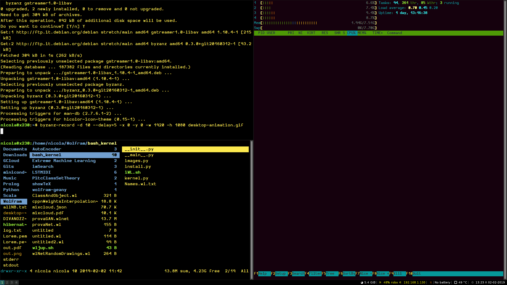

work in progress!

# JWLS

A **J**upyter notebook for **W**olfram(**L**anguage)**S**cript

**JWLS** is a slimmed down version of the Jupyter [`bash_kernel`](https://github.com/takluyver/bash_kernel) 
that pipes input cells into a [wolframscript](https://www.wolfram.com/wolframscript/) `Dialog[]` 
through a temporary fifo, and it reads the corresponding outputs from
the default wolframscript log file. 

The goal of **JWLS** is to *extend* the wolframscript cli with a HTML-based REPL interface.
As such, it comes particularly handy in cloud computing. 
For instance, you can launch on a remote machine where the
[intepreter](https://www.wolfram.com/cdf-player/) is installed, 
and connect it to a Jupyter notebook interface that runs locally in your browser.

### Installation

Depen
**Suggested**:`miniconda`, `firefox`

1. Copy the `JWLS_kernel` into your conda installation folder e.g. `~/miniconda3/lib/python3.7/site-packages/ 
2. Run the installation script in the kernel folder:  `python install.py`

### Usage

Run `JWLS.sh`

Graphics is rendered by the Jupyter file viewer, not by notebook. 
Show returns the URL of the graphical output.

### Features

The `Out[..]` expressions are returned on both the Jupyter notebook and the terminal 
where JWLS is started; though error messages, symbols `Information` and progress indicators are printed on terminal only.

### How it works

The `JWLS.sh` script reads your `jupyter notebook list` to save the address of the **first** notebook found; that is needed by `Show`.  If Jupyter is not running, JWLS will start a new notebook. 

The WolframKernel is then initiated in REPL mode waiting for commands sent by the `kernel.py` through a temporary fifo.
By default, wolframscript appends ouputs to a temporary log file; JWLS simply pipes the latest ouputs from that file back to Jupyter. 

